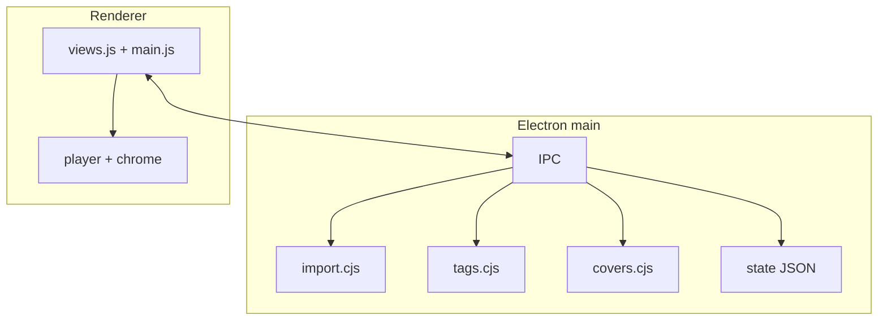

<div align="center">


# Senza

**Offline-first music library and player — your collection, your files.**

[](https://www.electronjs.org/)
[](https://vitejs.dev/)
[](LICENSE)
[]()
[]()
[]()

*Not streaming. Not subscriptions. Not algorithms.*

Part of the **[Floke](https://github.com/FlokeStudio/)** ecosystem.

</div>

## Navigation

| Section | English | Русский |
|---------|---------|---------|
| Language | [**English**](#english) | [**Русский**](#russian) |
| **For everyone** | [What is Senza?](#en-for-everyone) | [Для вас](#ru-for-everyone) |
| Overview | [Overview](#en-overview) | [Обзор](#ru-overview) |
| Features | [Features](#en-features) | [Возможности](#ru-features) |
| Architecture | [Architecture](#en-architecture) | [Архитектура](#ru-architecture) |
| Quick start | [Quick start](#en-quick-start) | [Быстрый старт](#ru-quick-start) |
| Usage | [Usage](#en-usage) | [Использование](#ru-usage) |
| Library layout | [Library](#en-library) | [Библиотека](#ru-library) |
| Project layout | [Project layout](#en-layout) | [Структура](#ru-layout) |
| Community | [Community](#en-community) | [Сообщество](#ru-community) |
| License | [License](#en-license) | [Лицензия](#ru-license) |
| Landing | [Floke site](https://flokestudio.github.io/Floke/) | [Сайт Floke](https://flokestudio.github.io/Floke/) |

---

<h2 id="english">English</h2>

<h3 id="en-for-everyone">For everyone</h3>

### What is Senza?

Senza is a **desktop music app** for people who keep music as **files on their computer** — ripped CDs, Bandcamp downloads, legacy MP3 collections, FLAC archives. It does not stream from the cloud. It does not need an account. It does not decide what you should hear next.

Think of it as **your shelf, digitized**: one calm place to import, organize, fix tags and covers, and listen — even with no internet.

### What you can do

| | |
|---|---|
| **Import** | Drop files or pick a folder; Senza copies music into a tidy library (`Artist / Album / track`). |
| **Browse** | All Tracks, Albums, Artists, Playlists — plus a **Collection** view with large album cards. |
| **Play** | Queue, progress bar, Now Playing panel, fullscreen player — pick up where you left off. |
| **Fix metadata** | Edit title, artist, album, genre, year, track number; attach a cover (any image → square crop). |
| **Understand your library** | **Music Vault** shows a Collection Score: tags, covers, and items that need attention. |
| **Remember what you loved** | **Listening Journal** — recent plays, top artists this week, **Music Time Capsule** (“about a year ago…”). |
| **Make it yours** | Profile with a random name and pixel avatar, or your own nickname and picture in the title bar. |

### Why Senza

| Advantage | What it means for you |
|-----------|------------------------|
| **Offline-first** | Listen on a plane, in a basement, anywhere — no “offline mode” toggle. |
| **You own the files** | Copy, back up, move the library folder; no lock-in to a service. |
| **No algorithm** | Your order, your playlists, your history — not a feed. |
| **Honest tagging** | See messy filenames? Smart Metadata Assistant suggests cleanup before you save. |
| **Calm design** | Apple Music–inspired layout with Floke’s warm gold accent — focused, not noisy. |
| **Private by default** | Play history stays on your PC. No upload. No telemetry in the product vision. |

### Works today · Coming later

| Today (1.0.0 Vivo) | Planned |
|--------------------|---------|
| Windows desktop + Glyph2.1-O | iOS companion (roadmap) |
| Flow home, Journal stats, bulk tags | Full tag write for FLAC and more |
| MP3 tag + cover + SQLite Glyph log | Portable `senza-library.zip` export |
| MusicBrainz / optional AcoustID / Ollama | Librosa BPM at import |

---

<h3 id="en-overview">Overview</h3>

| | |
|---|---|
| **What** | Offline music library + player (Electron) |
| **Release** | **1.0.0 — Vivo** ([`CHANGELOG.md`](CHANGELOG.md) · [Releases](https://github.com/FlokeStudio/Senza/releases)) |
| **Codename** | **Vivo** — living library, metadata that breathes |
| **Account** | None |
| **Network** | Not required for playback |
| **UI** | Dark/light · **EN / RU** · Monocraft wordmark · SF-style icons |

<h3 id="en-features">Features</h3>

#### Library & playback

| Feature | Description |
|---------|-------------|
| **Import** | Files, folder, drag & drop → `library/music/Artist/Album/`; import-time path normalization |
| **Formats** | mp3, flac, wav, ogg, m4a, aac (playback); **MP3 ID3 write** |
| **Views** | **Flow** (home), All Tracks, Albums, Artists, Playlists, **Collection** (large cards) |
| **Music Vault** | Collection Score /100; attention & no-cover lists; infer albums from folders |
| **Search** | Instant filter across title, artist, album |
| **Sort** | Tracks, albums, artists — key + direction |
| **Queue** | Next Up, drag reorder, persist between sessions |
| **Player** | Bottom bar + **Now Playing** sheet + **fullscreen** (centered in content area) |
| **Bulk editor** | Multi-select tracks → shared tag fields |
| **Playlists** | Real folders + `playlist.json` |
| **Album Focus** | Album detail + play all |
| **Artist photos** | Local portrait per artist (offline) |
| **Profile** | Identicon or custom avatar & display name in title bar |
| **Window** | Custom chrome (min / max / close) · **EN / RU** |

#### Glyph2.1-O (built-in, can be disabled)

| Feature | Description |
|---------|-------------|
| **Pipeline** | Rules, knowledge packs, ML heuristics, **KNN**, optional **MusicBrainz / AcoustID / Ollama** |
| **Tag editor** | Score, source badges, **diff view**, per-field chips, apply / reject / re-run |
| **Auto-tag import** | Optional fill after import |
| **Vault scan** | Suggested fixes, **duplicate groups** (tags, filename, optional fingerprint) |
| **Batch** | “Fill library” — scan, preview, apply many tracks |
| **Logging** | SQLite `glyph-log.sqlite` + export **JSONL** for fine-tune |
| **Learning** | User edits + exports → private knowledge pack |
| **Toggle off** | Plain tag editor; **SENZA** on Flow; no Glyph vault scan |

#### Flow & Journal

| Feature | Description |
|---------|-------------|
| **Flow** | Personal wave (~32 tracks), 4 modes, cover-driven ambient, BPM pulse |
| **Journal** | **Settings → Journal** — time in app, listening time, weekly top artists & **tracks**, Time Capsule |

Full Glyph docs: **[Glyph-MI/GUIDE.ru.md](../Glyph-MI/GUIDE.ru.md)** · Senza architecture: [`docs/ARCHITECTURE.md`](docs/ARCHITECTURE.md)

<h3 id="en-architecture">Architecture</h3>



Details: [`docs/ARCHITECTURE.md`](docs/ARCHITECTURE.md)

<h3 id="en-quick-start">Quick start</h3>

**Requirements:** Node.js **20+**, Windows **10/11** for `.exe` builds.

```bash
git clone https://github.com/FlokeStudio/Senza.git
cd Senza
npm install
npm run electron:dev:watch
```

**Windows release builds:**

```bash
npm run electron:build
# → release/Senza-1.0.0-x64.exe
# → release/Senza-1.0.0-Portable.exe
```

Icons: `icon.svg` → `npm run build:icons` → `build/icon.ico`

<h3 id="en-usage">Usage</h3>

1. Launch **Senza** and open **Import** — add files or a folder (or drag onto the window).
2. Browse **All Tracks**, **Albums**, or **Artists**; use **Collection** for large cards.
3. Double-click a row to play (or enable **click lock** in Settings → Playback).
4. Right-click a track — Play, Add to playlist, Edit tags.
5. **Music Vault** — check Collection Score and fix gaps.
6. **Flow** — create a wave; switch modes; play from recent imports.
7. **Settings** — theme, language, **Glyph2.1-O**, library tree, **Journal**, profile, about.
7. Title-bar **avatar** — opens Profile settings.

<h3 id="en-library">Library on disk</h3>

Default root: `%APPDATA%/senza/`

```
senza/
├── senza-state.json
└── library/
    ├── music/Artist/Album/track.ext
    ├── covers/{trackId}.jpg
    ├── playlists/{slug}/playlist.json
    ├── glyph/                 # cache, glyph-log.sqlite, exports, knowledge
    └── profile-avatar.jpg   (optional)
```

<h3 id="en-layout">Project layout</h3>

```
Senza/
├── electron/           # main process + glyph-*.cjs
├── glyph-mi/           # Glyph engine mirror (@glyph)
├── src/                # renderer (HTML, CSS, JS)
├── docs/               # VISION, ARCHITECTURE, GLYPH link, release notes
├── scripts/            # build-icons, glyph mirror, lab template
├── senza.release.json  # version & codename (Vivo)
├── icon.svg
└── release/            # after electron:build
```

<h3 id="en-community">Community</h3>

| Doc | Purpose |
|-----|---------|
| [CONTRIBUTING.md](CONTRIBUTING.md) | Dev setup, PRs, releases |
| [CODE_OF_CONDUCT.md](CODE_OF_CONDUCT.md) | Community standards |
| [SECURITY.md](SECURITY.md) | Report vulnerabilities |
| [CHANGELOG.md](CHANGELOG.md) | Version history |
| [docs/VISION.md](docs/VISION.md) | Product vision & roadmap |
| [docs/release-notes-v1.0.0-vivo-github.md](docs/release-notes-v1.0.0-vivo-github.md) | GitHub Release body (1.0.0) |
| [Glyph-MI/GUIDE.ru.md](../Glyph-MI/GUIDE.ru.md) | Glyph2.1-O — full engine guide |

<h3 id="en-license">License</h3>

**[GNU GPL v3](LICENSE)** — by Floke Studio.

---

<h2 id="russian">Русский</h2>

*Твоя коллекция. Твои файлы. Без лишнего.*

<h3 id="ru-for-everyone">Для вас</h3>

### Что такое Senza?

**Senza** — настольный музыкальный плеер для тех, кто хранит музыку **файлами на компьютере**: CD-рипы, покупки с Bandcamp, старые MP3, FLAC-архивы. Без стриминга из облака. Без аккаунта. Без алгоритмической ленты.

Один спокойный дом: **импорт → порядок в библиотеке → теги и обложки → прослушивание** — даже без интернета.

### Что можно делать

| | |
|---|---|
| **Импорт** | Файлы, папка или перетаскивание — копии в `Артист / Альбом / трек`. |
| **Обзор** | Все треки, Альбомы, Исполнители, Плейлисты, режим **Коллекция**. |
| **Воспроизведение** | Очередь, прогресс, панель «Сейчас играет», полноэкранный режим. |
| **Метаданные** | Редактор тегов и обложки (любое фото → квадратный кроп). |
| **Music Vault** | Оценка коллекции: теги, обложки, что требует внимания. |
| **Журнал** | Недавние прослушивания, топ за неделю, **Music Time Capsule**. |
| **Профиль** | Случайное имя и пиксель-аватар или свои ник и фото в шапке. |

### Почему Senza

| Преимущество | Для вас |
|--------------|---------|
| **Offline-first** | Слушайте где угодно — не нужен «офлайн-режим». |
| **Файлы ваши** | Копируйте и бэкапьте папку библиотеки. |
| **Без алгоритма** | Ваш порядок и ваши плейлисты. |
| **Умные подсказки** | Помощник метаданных из имени файла. |
| **Спокойный интерфейс** | В духе Apple Music + золотой акцент Floke. |
| **Приватность** | История только на вашем ПК. |

---

<h3 id="ru-overview">Обзор</h3>

| | |
|---|---|
| **Что** | Offline-библиотека и плеер (Electron) |
| **Релиз** | **1.0.0 — Vivo** ([`CHANGELOG.md`](CHANGELOG.md)) |
| **Аккаунт** | Не нужен |
| **Сеть** | Не нужна для прослушивания |
| **Интерфейс** | Тёмная/светлая тема · **EN / RU** |

<h3 id="ru-features">Возможности</h3>

Полный список — [таблица возможностей на английском](#en-features) (**1.0.0 Vivo**). Glyph: [GUIDE.ru.md](../Glyph-MI/GUIDE.ru.md).

<h3 id="ru-architecture">Архитектура</h3>

См. [диаграмму выше](#en-architecture) и [`docs/ARCHITECTURE.md`](docs/ARCHITECTURE.md).

<h3 id="ru-quick-start">Быстрый старт</h3>

```bash
git clone https://github.com/FlokeStudio/Senza.git
cd Senza
npm install
npm run electron:dev:watch
```

Сборка Windows: `npm run electron:build`

<h3 id="ru-usage">Использование</h3>

1. **Импорт** — файлы, папка или drag & drop.
2. Разделы **Все треки**, **Альбомы**, **Исполнители**, **Коллекция**.
3. Клик по строке — воспроизведение; ПКМ — меню.
4. **Music Vault** — здоровье коллекции.
5. **Поток** — волна, режимы, недавние импорты.
6. **Настройки** — тема, **Glyph2.1-O**, библиотека, **Журнал**, профиль.
6. **Аватар в шапке** → профиль.

<h3 id="ru-library">Библиотека на диске</h3>

`%APPDATA%/senza/` — см. [структуру выше](#en-library).

<h3 id="ru-layout">Структура проекта</h3>

См. [английский раздел](#en-layout).

<h3 id="ru-community">Сообщество</h3>

| Документ | Зачем |
|----------|--------|
| [CONTRIBUTING.md](CONTRIBUTING.md) | Разработка и PR |
| [SECURITY.md](SECURITY.md) | Уязвимости |
| [docs/VISION.md](docs/VISION.md) | Видение продукта |

<h3 id="ru-license">Лицензия</h3>

**[GNU GPL v3](LICENSE)** — Floke Studio.

---

<div align="center">

**Senza** · offline-first · your library · your device

[English](#english) · [Русский](#russian)

[Releases](https://github.com/FlokeStudio/Senza/releases) · [Floke](https://github.com/FlokeStudio/) · [Issues](https://github.com/FlokeStudio/Senza/issues)

</div>
